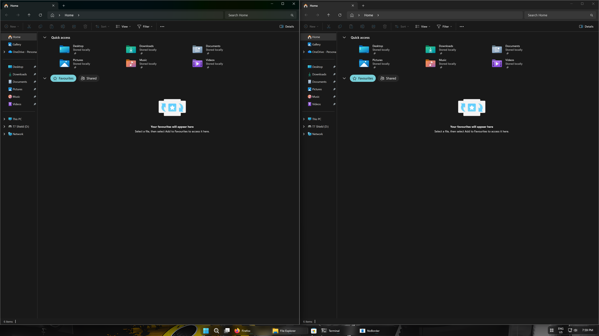
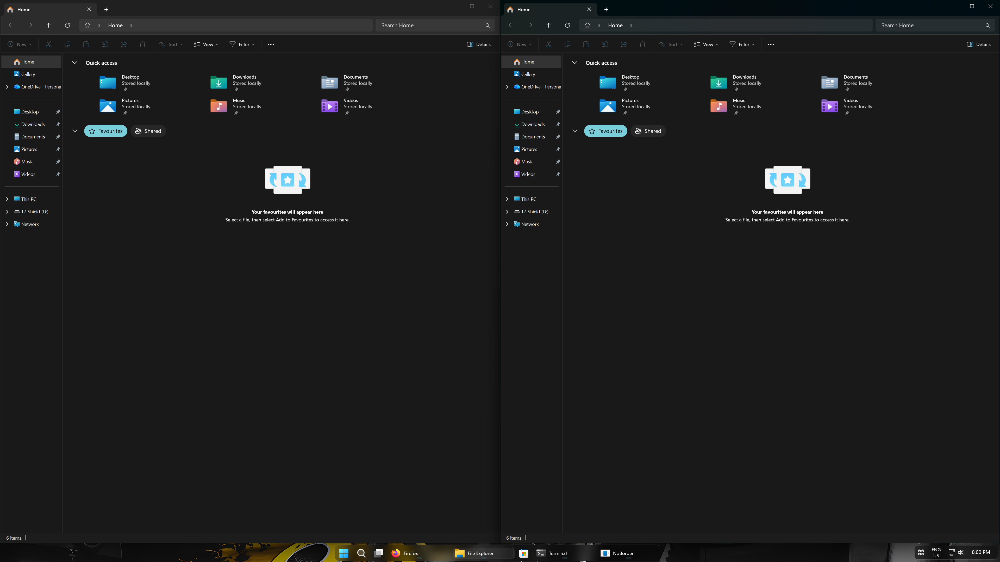

# USE IT AT YOUR OWN RISK.

NOTE: This is a somewhat vibecoded personal project that I decided to share.

Removes the white border that appears around windows on Windows 11
(most noticeable when snapping windows side by side).

This is unrelated to the `BorderWidth` / `PaddedBorderWidth` registry values —
those control the resize-grab area, not the accent border DWM paints around
focused/snapped windows.

## Requirements

- Windows 11 22H2 or later (this is when `DWMWA_BORDER_COLOR` was added — on
  older builds `DwmSetWindowAttribute` will just silently no-op).
- [.NET 8 SDK](https://dotnet.microsoft.com/download) installed to build it.

## Build

Open a terminal (PowerShell or cmd) in this folder and run:

```
dotnet build -c Release
```

The compiled exe will be at:

```
bin\Release\net8.0-windows\NoBorder.exe
```

You can copy that single .exe anywhere you like (e.g. `C:\Tools\NoBorder\`)
— it has no other dependencies.

## Before/After




## Usage

Run from a terminal, or just double-click for `--once`-style usage isn't
default — you need to pass an argument, so easiest is a terminal or a
shortcut with the argument baked in.

| Command | What it does |
|---|---|
| `NoBorder.exe --once` | Applies the fix to all currently open windows, then exits. Good for a single session — run it once after login and forget about it. Existing windows lose the border; brand-new windows opened afterward won't be covered unless you run it again. |
| `NoBorder.exe --watch` | Applies the fix immediately, then keeps running in the background and re-applies it whenever windows are created, shown, moved/snapped, or restored. Leaves a console window open (or run via `start /min` — see below — to keep it out of the way). |
| `NoBorder.exe --install-startup` | Registers `NoBorder.exe --watch` to launch automatically at login (per-user, via the `HKCU\...\Run` registry key — no admin rights needed). |
| `NoBorder.exe --uninstall-startup` | Removes that startup entry. |

### Running --watch without a visible console window

To run `--watch` in the background without a console window staying open,
create a shortcut with this target instead of running the exe directly:

```
C:\Windows\System32\cmd.exe /c start /min "" "C:\Tools\NoBorder\NoBorder.exe" --watch
```

Or simpler: rename a copy of the build output, or just accept the console
window — minimizing it works fine since the hook runs regardless of focus.

### Recommended setup

For "set and forget": run `NoBorder.exe --install-startup` once. From then
on it starts in `--watch` mode automatically every time you log in.

For occasional/manual use: just run `NoBorder.exe --once` whenever you
notice the border and want it gone for that session.

## How it works

- `--once` enumerates all visible top-level windows and calls
  `DwmSetWindowAttribute(hwnd, DWMWA_BORDER_COLOR, DWMWA_COLOR_NONE)` on each.
- `--watch` does the same sweep at startup, then uses `SetWinEventHook` to
  listen system-wide for foreground changes, move/resize (which covers snap
  operations), minimize/restore, and window-show events, reapplying the
  attribute to whichever window triggered the event.
- Nothing is injected into other processes, no DLLs are hooked, and no
  files outside the registry `Run` key (only if you opt into startup) are
  touched. It only ever calls a single documented DWM API on window handles
  it doesn't own — same mechanism apps like PowerToys use for similar
  per-window DWM tweaks.

## Uninstall / revert

- If you used `--install-startup`, run `--uninstall-startup` to stop it
  launching at login.
- Borders return to normal automatically the next time DWM redraws them
  (e.g. after you stop running `--watch`, or after restarting Explorer/
  signing out) — there is no persistent system modification, since the
  attribute is per-window and reset by Windows itself when a window is
  recreated.
